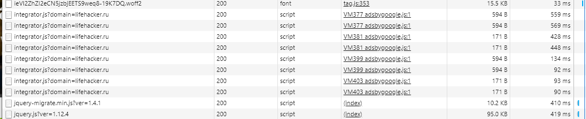
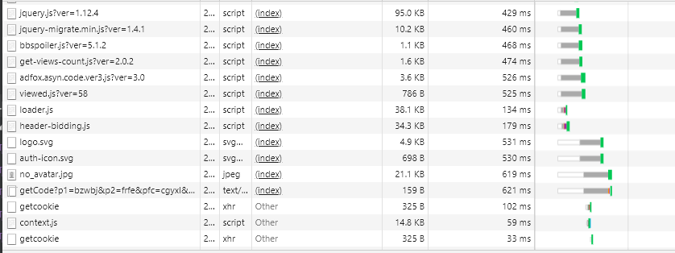

## Network

Анализ проводился во вкладке инкогнито с отключенным кешом.
При загрузке было обнаружено следующее:
1) Множество дублирующихся ресурсов:

2) Есть неминифицированные ресурсы:

3) Некоторые ресурсы грузятся дольше секунды:

4) Есть ресурсы, которые блокируют загрузки

Заглянув в html, которые отдает lifehacker, можно увидеть скрипты прописанные без async/defer в head

Если посмотреть на Waterfall, то видно, что есть ресурсы, ожидающие загрузку этих скриптов.

Профиль загрузки приложен в корень проекта - lifehacker.ru.har  
